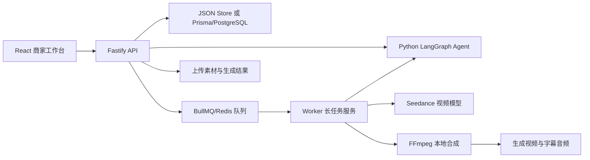
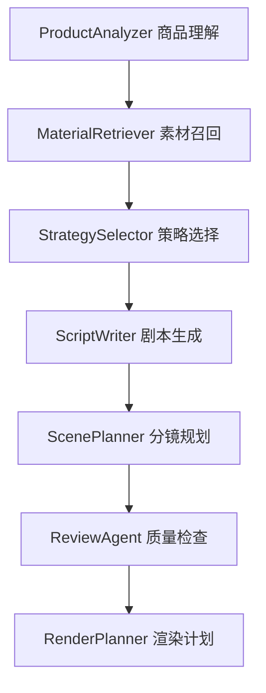

# 提交与答辩指南

这份文档用于准备比赛提交材料、演示视频和现场答辩。

## 项目信息

项目名称：

```text
AdVivid AI：电商带货视频智能创作系统
```

一句话价值：

```text
帮助商家从商品素材和卖点出发，自动生成可编辑、可导出、可复盘的短视频带货内容，降低内容生产成本并提升投放迭代效率。
```

项目定位：

```text
不是简单的视频生成工具，而是一个面向商家的电商短视频智能创作工作台。
```

## 当前完成度

P0 主链路已完成：

- 商品信息录入。
- 素材上传和预览。
- 剧本生成。
- 分镜生成。
- 任务进度。
- 一键成片。
- 在线预览。
- 视频导出。

P1 亮点已实现：

- Python LangChain/LangGraph 创作 Agent。
- 商品理解、素材召回、策略选择、剧本生成、分镜规划、质量检查、渲染计划。
- 生成 trace 展示。
- BullMQ/Redis 长任务队列。
- Prisma/PostgreSQL 持久化方案。
- 素材结构化、标签、摘要、视频切片、缩略图。
- 本地混合检索和分镜素材推荐。
- 分镜级编辑、单镜重生成、单镜预览。
- FFmpeg 字幕、BGM、mock TTS 合成。
- Seedance 视频生成接入和 FFmpeg 兜底。
- Mock 数据看板。

部署交付能力：

- 本地零数据库运行。
- Docker Compose 生产 Demo 拓扑。
- Nginx 网关。
- Windows `E:/envment` 数据和缓存目录约束。
- 部署检查和启动脚本。

## 系统架构讲法



答辩表达：

```text
前端 React 负责商家的创作工作台，Node.js/Fastify 负责 API、数据、文件和任务调度。AI 创作流程没有写死在接口里，而是放进 Python LangGraph Agent，由多个节点完成商品理解、素材召回、创意策略、剧本、分镜、审核和渲染计划。视频生成走异步任务，能接 Seedance，也保留 FFmpeg 兜底，保证演示稳定。
```

## AI Agent 讲法



每个节点的意义：

- `ProductAnalyzer`：把商品标题、卖点、人群、场景变成结构化商品画像。
- `MaterialRetriever`：从用户上传素材和切片里找适合分镜的素材。
- `StrategySelector`：选择痛点开场、场景种草、测评对比等创意策略。
- `ScriptWriter`：输出完整带货剧本。
- `ScenePlanner`：拆成 5 到 8 个可执行分镜。
- `ReviewAgent`：检查时长、字幕、商品一致性和表达风险。
- `RenderPlanner`：把分镜转成视频渲染计划。

亮点表达：

```text
大模型在这里不是只生成一段文案，而是作为创作流程中的 Agent，参与商品理解、素材匹配、策略选择、分镜规划和质量检查。每一步都有 trace，可以被前端展示，也方便失败定位和重试。
```

## 演示视频脚本

建议录制 3 到 5 分钟。

1. 打开首页，说明这是商家工作台，不是单次生成页面。
2. 输入一个商品，例如“便携冷萃咖啡杯”。
3. 上传商品图或商品视频。
4. 展示素材分析结果：标签、摘要、切片、缩略图。
5. 点击生成剧本，进入任务页看进度。
6. 展示 LangGraph trace：商品理解、素材召回、策略选择、剧本、分镜、审核。
7. 回到创作台，展示剧本和分镜。
8. 选中一个分镜，修改字幕或时长。
9. 展示推荐素材，绑定到当前分镜。
10. 点击单镜预览，说明支持局部重生成。
11. 点击一键成片，展示任务进度。
12. 打开生成视频，展示字幕、BGM、画面和导出。
13. 打开看板，说明 Mock 数据回流用于后续优化创意因子。
14. 最后总结技术亮点和业务价值。

## 稳定演示建议

如果网络或模型 Key 不稳定：

```bash
USE_MOCK_AI=true
VIDEO_RENDER_PROVIDER=ffmpeg
QUEUE_DRIVER=local
STORE_DRIVER=json
```

这样可以稳定跑通端到端流程。

如果要展示真实 Seedance 尝试：

```bash
USE_MOCK_AI=false
VIDEO_RENDER_PROVIDER=auto
```

需要确保 `.env` 中有真实 `ARK_API_KEY` 和视频 endpoint。不要在录屏、截图或 README 中展示 `.env`。

## 常见答辩问题

问题：为什么前端用 React？

回答：

```text
React 适合构建状态复杂、交互较多的工作台页面。这个项目里有素材库、分镜编辑、任务进度、视频预览和数据看板，React 的组件化和状态管理更适合这类界面。
```

问题：为什么后端仍然用 Node.js，而不是全部 Python？

回答：

```text
Node.js 负责工程基础设施，比如 HTTP API、文件上传、任务队列、数据库读写和前后端类型协作。Python 负责 AI Agent，因为 LangChain 和 LangGraph 的 Python 生态更适合我理解和扩展。这样工程职责清晰，也符合全栈挑战赛要求。
```

问题：LangGraph 的价值是什么？

回答：

```text
它把大模型创作拆成多个可追踪节点，而不是一个黑盒 Prompt。每个节点可以独立校验、记录 trace、失败重试，也方便前端展示“AI 正在做什么”。
```

问题：如果外部模型失败怎么办？

回答：

```text
系统设计了 Mock 兜底和 FFmpeg 兜底。文本模型失败时可以走本地模板，Seedance 失败时可以用 FFmpeg 生成可播放视频，保证演示和核心流程不会中断。
```

问题：这个项目和普通视频生成工具有什么区别？

回答：

```text
普通视频生成工具更像一次性输入 Prompt 得到结果。本项目围绕电商商家的真实流程，包含素材管理、剧本、分镜、局部编辑、长任务、视频导出和数据复盘，强调可控、可追踪、可迭代。
```

## 提交材料清单

必须准备：

- 在线 Demo 链接或本地运行说明。
- 演示视频。
- 源代码仓库。
- README。
- 架构说明。
- API 简表。
- 数据库说明。
- AI Agent 流程说明。
- 部署说明。
- 1 到 2 条生成视频样例。
- 产品截图。

建议截图：

- 创作台。
- 素材库。
- 素材切片。
- LangGraph trace。
- 分镜编辑器。
- 任务进度页。
- 视频预览导出。
- 数据看板。

## 当前限制与后续优化

可以主动说明的限制：

- 第一版重点是打通创作链路，真实投放数据使用 Mock。
- pgvector 字段已预留，当前检索先用本地 mock embedding 和关键词混合检索。
- 对象存储还未接入，当前使用本地 `uploads/` 和 `rendered/`。
- TTS 当前有 mock 音轨，后续可接入真实 TTS。

后续方向：

- 接入真实电商投放数据。
- 用 pgvector 做真实向量召回。
- 用对象存储替代本地文件。
- 支持更多视频比例和模板。
- 加入内容合规审核流。
- 加入 A/B 自动生成和多版本对比。
