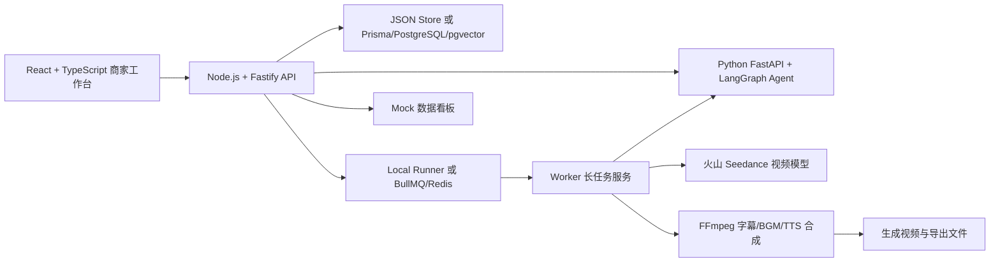

# 比赛提交材料草稿

这份文档可以直接作为提交表、答辩稿和演示视频脚本的母版。带 `待填写` 的内容需要在最终提交前补齐。

## 基础信息

项目名称：

```text
AdVivid AI：电商带货视频智能创作系统
```

参赛课题：

```text
电商场景 AIGC 带货视频生成系统
```

团队成员与分工：

```text
待填写：
- 成员 A：前端工作台、交互设计、演示材料
- 成员 B：Node.js API、任务队列、数据存储
- 成员 C：Python LangGraph Agent、模型接入、视频生成
```

一句话业务价值：

```text
帮助商家从商品素材和卖点出发，自动生成可编辑、可导出、可复盘的短视频带货内容，降低内容生产成本并提升投放迭代效率。
```

在线 Demo：

```text
待填写：部署后的 Web 地址
```

演示视频：

```text
待填写：3-5 分钟演示视频链接
```

源代码仓库：

```text
待填写：Git 仓库链接
```

## 核心功能

1. 商品项目与素材库：商家录入商品标题、卖点、人群、场景和创作补充要求，上传商品图片、商品视频或参考素材，并查看素材摘要、标签、切片和预览。
2. Python LangGraph 创作 Agent：将商品理解、素材召回、策略选择、剧本生成、分镜规划、质量检查和渲染计划拆成可追踪节点。
3. 结构化剧本与连续分镜：根据商品和策略生成 5-6 个连续分镜，包含画面、镜头、台词、字幕、BGM、时长和素材绑定建议。
4. 分镜级编辑与单镜预览：支持修改台词、字幕、画面描述、镜头、时长，替换素材，调整顺序，单镜重生成和单镜预览。
5. 一键成片与稳定兜底：优先尝试 Seedance，失败时自动回退 FFmpeg，输出带字幕、BGM 和 mock TTS 的 15-20 秒短视频。
6. 任务进度、Trace 与数据看板：长任务显示状态、进度、失败原因和重试入口；看板用 mock 数据展示创作因子与播放、CTR、转化的关系。

## 端到端流程

1. 商家打开 AdVivid AI 工作台，新建一个商品视频项目。
2. 在创作台录入商品标题、核心卖点、目标人群、使用场景、创作策略、目标时长和 Prompt 微调要求。
3. 商家进入素材库上传商品主图、商品视频或参考素材，系统自动分析素材摘要、标签、embedding 和视频切片。
4. 点击生成剧本后，Node.js API 创建异步任务，Python LangGraph Agent 依次完成商品理解、素材召回、策略选择、剧本生成、分镜规划和质量检查。
5. 前端任务页展示任务状态、进度和生成 trace，商家可以看到 AI 每一步做了什么。
6. 剧本生成完成后，商家回到创作台查看完整带货剧本和分镜列表，并对单个分镜进行台词、字幕、画面、时长、素材绑定和排序调整。
7. 商家可以对某个分镜单独重生成或单镜预览，确认局部效果后再发起整片渲染。
8. 系统根据分镜渲染计划生成视频，支持 9:16/16:9、720p/1080p 导出，并在看板中用 mock 数据展示后续投放优化思路。

## 系统架构



## AI 能力说明

```text
系统后端保留 Node.js 作为工程基础设施，AI 创作链路交给 Python LangGraph Agent。Agent 不是单次 Prompt，而是把创作过程拆成 ProductAnalyzer、MaterialRetriever、StrategySelector、ScriptWriter、ScenePlanner、ReviewAgent、RenderPlanner 七个节点。每个节点输出结构化 JSON，通过 Pydantic/Zod schema 校验，并记录 generation_traces 供前端展示。
```

模型与兜底：

- 文本生成：优先调用火山方舟 Doubao 文本模型，失败时走本地 TypeScript/Python 模板兜底。
- 视频生成：优先调用 Seedance，支持分段生成后 FFmpeg 拼接；失败时走本地 FFmpeg 兜底。
- 检索：当前使用关键词、标签和 mock embedding 的本地混合检索；PostgreSQL schema 已预留 pgvector 字段。
- 音频：当前演示使用 mock TTS 和 mock BGM；后续可替换为真实 TTS。

## 工程难点与解决方案

1. 长任务耗时和不稳定：用 render_jobs 记录任务状态，支持 local runner 和 BullMQ 两种执行方式，前端轮询进度，失败后可重试。
2. 外部模型不确定性：所有模型调用都有 mock 或 FFmpeg 兜底，保证评审现场不因 Key、网络或配额问题中断。
3. 剧本与视频连续性：Agent prompt 和兜底模板都要求商品贯穿全片，按照开场问题、商品介入、卖点证明、多场景使用和软 CTA 的叙事节奏组织分镜。
4. 可编辑而非黑盒：剧本保存为 script/scenes 结构，用户可以编辑单个分镜、绑定素材、单镜重生成和预览，再重新渲染整片。
5. 素材可复用：上传素材会被结构化为摘要、标签、切片和 embedding，后续分镜可自动推荐最匹配素材。

## 部署与访问

本地运行：

```bash
npm install
npm run setup:python
npm run dev
```

访问地址：

```text
Web: http://localhost:5173
API: http://localhost:4000/api/health
Python Agent: http://localhost:8002/health
```

生产 Demo：

```bash
docker compose --env-file .env -f infra/docker/docker-compose.prod.yml up --build -d
```

安全说明：

- 真实 API Key 只写入 `.env`，不写入 `.env.example`、README、截图或演示视频。
- 前端不会拿到模型 Key，所有模型调用均由服务端完成。
- 若需要新增数据库或运行时依赖，Windows 本地统一放到 `E:/envment`。

## 三个亮点

1. 可追踪电商创作 Agent：LangGraph 把商品理解、素材召回、创作策略、剧本、分镜和质检拆成可解释节点。
2. 分镜级可控视频生成：用户可以编辑、替换素材、局部重生成、单镜预览，不是一次性黑盒视频生成。
3. 演示稳定的工程闭环：Seedance、Ark、队列、Trace、FFmpeg、Mock 数据看板和失败兜底组合成可完整跑通的作品。

## 当前完成状态

```text
P0：已完成，可端到端演示。
P1：主要能力已完成，包括 Agent、trace、素材结构化、分镜编辑、字幕/BGM/mock TTS、失败重试、Mock 看板。
P2：已展示设计思路，CI、A/B/归因、合规审核、观测性可作为后续扩展。
```
